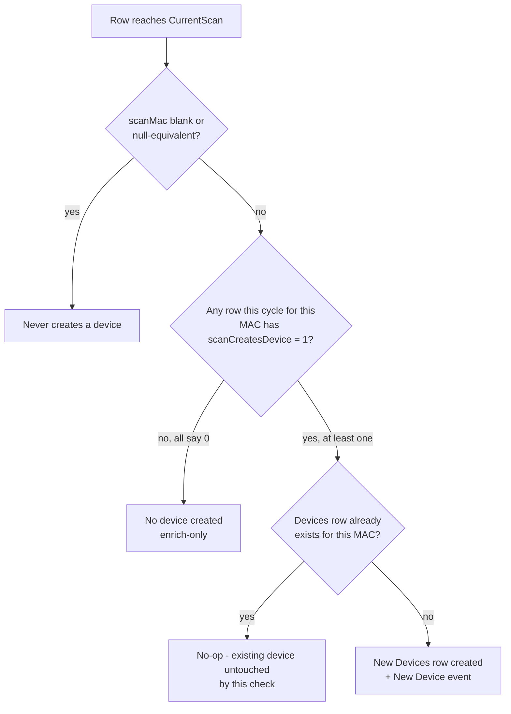
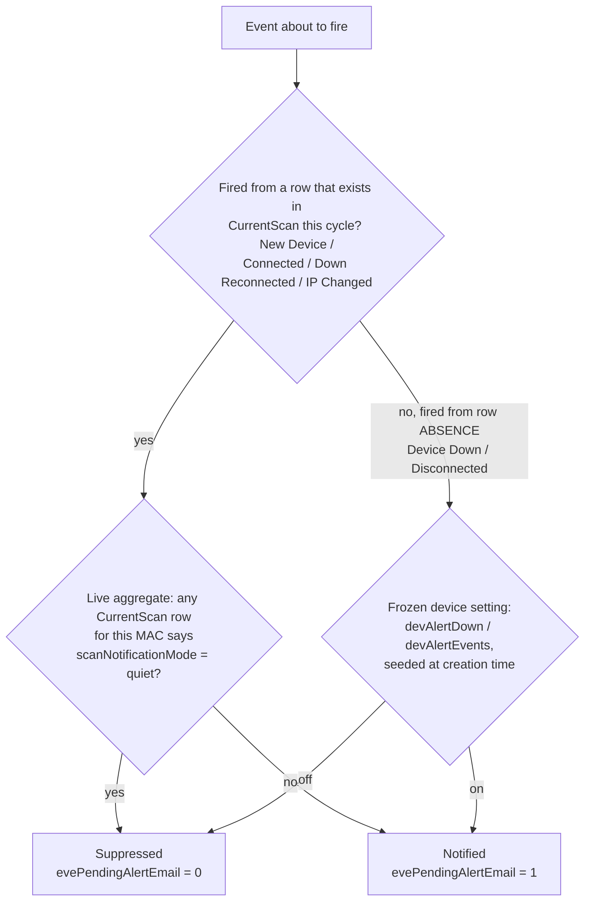

# Plugin Import Behavior

Three optional `CurrentScan` columns, all independent of each other, control what happens once a row your plugin reports reaches the `CurrentScan` table: whether it can create a device, whether it counts as a live presence signal, and whether its notifications are suppressed. This only matters if your plugin maps to `mapped_to_table: "CurrentScan"` — see the [Data contract](PLUGINS_DEV_DATA_CONTRACT.md) for the base column spec these three sit alongside.

| Column | Type | Default | Meaning |
|---|---|---|---|
| `scanCreatesDevice` | boolean | `1` | Whether this row can originate a *new* `Devices` entry. `0` lets an enrich-only plugin (e.g. a hostname resolver) update an already-existing device's fields without ever being able to create one. |
| `scanNotificationMode` | text (`normal` \| `quiet`) | `normal` | Whether this row's notifications are suppressed. `quiet` always suppresses the outbound email/push; whether the `Events` row itself still gets written depends on the event. **Live** (per-cycle aggregate, reclassifying a row changes future events): `New Device`, `Connected`, `Down Reconnected`, `IP Changed` — audit trail always written. `New Device` isn't gated on `scanPresence = 1` like the other three (see flowcharts below). **Frozen** (`devAlertDown`/`devAlertEvents` seeded at device creation, reclassifying later has no retroactive effect): `Device Down`, `Disconnected` — not symmetric. `Disconnected` always writes its `Events` row (`evePendingAlertEmail = 0` when quiet). `Device Down` writes **no row at all** when `devAlertDown = 0`. |
| `scanPresence` | boolean | `1` | Whether this row asserts the device is *currently online*. `0` means "identity/inventory data, no presence claim" — not "offline". A reservation, a lease record, or a static IPAM entry are typical `0` cases. |

**Missing vs. invalid values — these behave differently, not interchangeably:**

| Column | Column never mapped (missing) | Mapped but sent an unexpected value (invalid) |
|---|---|---|
| `scanCreatesDevice` | `1` (schema `DEFAULT`) | `CHECK (scanCreatesDevice IN (0, 1))` — anything else fails the `INSERT` outright, it does not silently fall back to `1` |
| `scanNotificationMode` | `normal` (schema `DEFAULT`) | No `CHECK` constraint — any string other than the literal `'quiet'` is treated as `normal`, since the SQL only special-cases that exact value |
| `scanPresence` | `1` (schema `DEFAULT`) | `CHECK (scanPresence IN (0, 1))` — same as `scanCreatesDevice`, invalid values fail the `INSERT`, they don't default |

**Multiple plugins reporting the same MAC in the same scan cycle** (the normal case, not an edge case — see the `scan-pipeline` skill) resolve per column, not uniformly: `scanCreatesDevice` and `scanPresence` are most-permissive-wins (any row saying `1` wins), while `scanNotificationMode` is most-*restrictive*-wins (any row saying `quiet` suppresses the notification, even if a sibling row says `normal`) — erring toward under-notifying rather than spamming.

**Combination matrix** — not every combination is meaningful for every plugin; pick the one that matches what your plugin actually knows:

| `scanCreatesDevice` | `scanPresence` | Meaning |
|---|---|---|
| 1 | 1 | Normal discovery (the default) |
| 1 | 0 | Inventory/identity import — create the device, but don't claim it's online right now |
| 0 | 1 | Presence-confirming enrichment — never originate a device, but assert presence for one that exists |
| 0 | 0 | Silent enrichment — never originate a device, no presence claim either |

`scanNotificationMode` is orthogonal to both of the above and can be combined with any row in the table (e.g. inventory import + quiet, for a fully silent bulk import of known-offline devices).

**Decision: does this row create a device?**

**Decision: is this event's notification suppressed?**

**Worked scenarios:**

| Scenario | `scanCreatesDevice` | `scanPresence` | `scanNotificationMode` | `scanMac` | Outcome |
|---|---|---|---|---|---|
| Normal discovery (default plugin behavior) | `1` (default) | `1` (default) | `normal` (default) | real MAC | Device created if new, notified normally, presence tracked live. |
| Enrich-only plugin (e.g. a hostname resolver) | `0` | `1` (default) | `normal` (default) | real MAC | Never originates a device; still updates an existing device's fields via `FIELD_SPECS`. If another plugin reports the same MAC with `scanCreatesDevice = 1`, the device still gets created (most-permissive-wins) — this plugin's `0` doesn't block it. |
| Bulk inventory import of known-offline devices | `1` | `0` | `quiet` | real MAC | Creates devices without claiming they're online, and without a wave of "New Device" notifications for a large batch import. |
| Presence-confirming enrichment (e.g. a DHCP lease scanner) | `0` | `1` | `normal` | real MAC | Confirms an *existing* device is online without ever being the plugin that creates it. |
| Row with no usable device identity (e.g. an object with no routable MAC available) | `0` | irrelevant | irrelevant | blank / null-equivalent | Never creates a device — but not for symmetric reasons. The blank-MAC guard blocks the whole aggregated group by its shared `scanMac` value, regardless of any individual row's `scanCreatesDevice` (even a stray `1` from an unrelated plugin sharing the same blank `scanMac` can't override it). Setting `scanCreatesDevice = 0` here is still correct practice, but on its own is only this row's vote — most-permissive-wins means a sibling row for the same `scanMac` asserting `1` would still win. The blank-MAC guard is what actually guarantees safety regardless of what other contributors do. |
