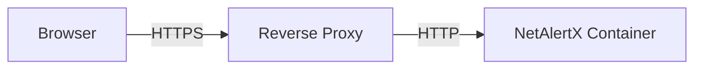
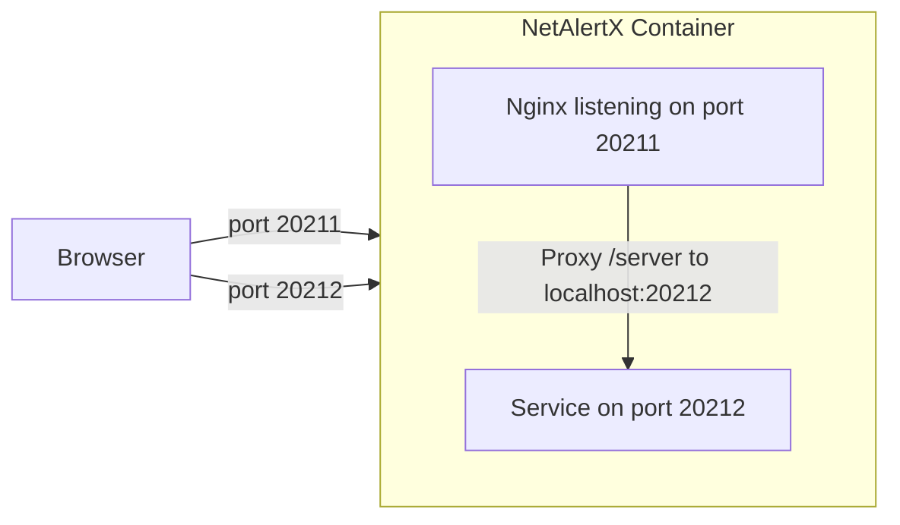
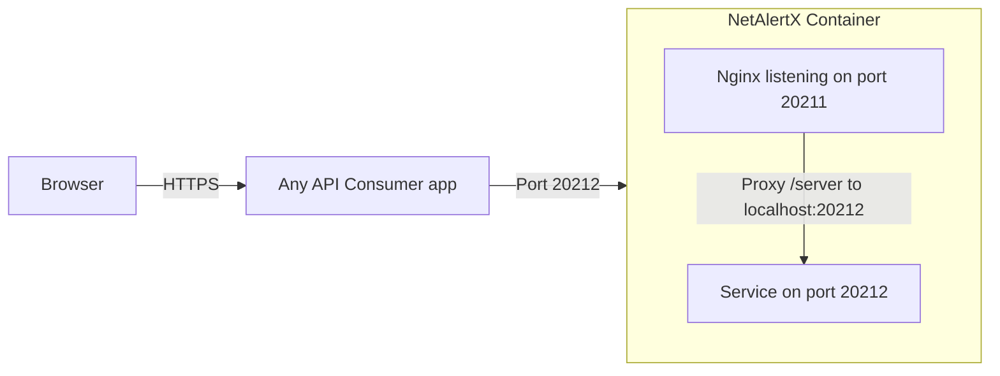
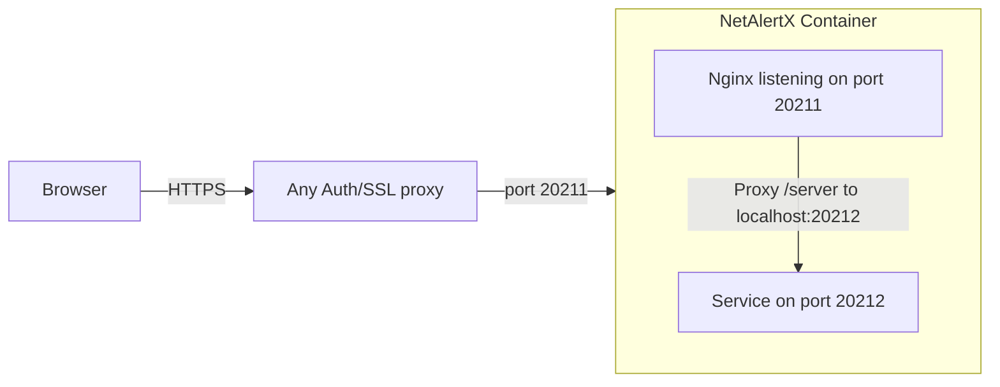
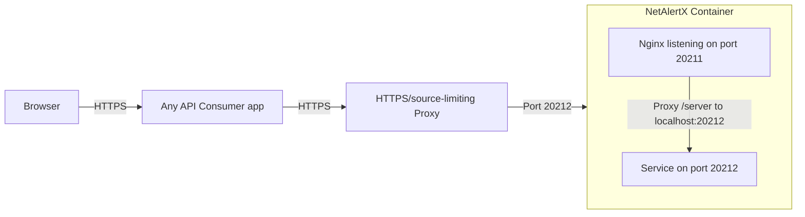

# Reverse Proxy Configuration

A reverse proxy is a server that sits between users and your NetAlertX instance. It allows you to:
- Access NetAlertX via a domain name (e.g., `https://netalertx.example.com`).
- Add HTTPS/SSL encryption.
- Enforce authentication (like SSO).

## NetAlertX Ports

NetAlertX exposes two ports that serve different purposes. Your reverse proxy can target one or both, depending on your needs.

| Port | Service | Purpose |
|------|---------|---------|
| **20211** | Nginx (Web UI) | The main interface. |
| **20212** | Backend API | Direct access to the API and GraphQL. Includes API docs you can view with a browser. |

> [!WARNING]
> **Do not document or use `/server` as an external API endpoint.** It is an internal route used by the Nginx frontend to communicate with the backend.

## Connection Patterns

### 1. Default (No Proxy)
For local testing or LAN access. The browser accesses the UI on port 20211. Code and API docs are accessible on 20212.

### 2. Direct API Consumer (Not Recommended)
Connecting directly to the backend API port (20212).

> [!CAUTION]
> This exposes the API directly to the network without additional protection. Avoid this on untrusted networks.

### 3. Recommended: Reverse Proxy to Web UI
Using a reverse proxy (Nginx, Traefik, Caddy, etc.) to handle HTTPS and Auth in front of the main UI.

### 4. Recommended: Proxied API Consumer
Using a proxy to secure API access with TLS or IP limiting.

**Why is this important?**
The backend API (`:20212`) is powerful—more so than the Web UI, which is a safer, password-protectable interface. By using a reverse proxy to **limit sources** (e.g., allowing only your Home Assistant server's IP), you ensure that only trusted devices can talk to your backend.

## Getting Started: Nginx Proxy Manager

For beginners, we recommend **[Nginx Proxy Manager](https://nginxproxymanager.com/)**. It provides a user-friendly interface to manage proxy hosts and free SSL certificates via Let's Encrypt.

1. Install Nginx Proxy Manager alongside NetAlertX.
2. Create a **Proxy Host** pointing to your NetAlertX IP and Port `20211` for the Web UI.
3. (Optional) Create a second host for the API on Port `20212`.

### Configuration Settings

When using a reverse proxy, you should verify two settings in **Settings > Core > General**:

1. **BACKEND_API_URL**: This should be set to `/server`.
   * *Reason:* The frontend should communicate with the backend via the internal Nginx proxy rather than routing out to the internet and back.

2. **REPORT_DASHBOARD_URL**: Set this to your external proxy URL (e.g., `https://netalertx.example.com`).
   * *Reason:* This URL is used to generate proper clickable links in emails and HTML reports.

## Other Reverse Proxies

NetAlertX uses standard HTTP. Any reverse proxy will work. Simply forward traffic to the appropriate port (`20211` or `20212`).

For configuration details, consult the documentation for your preferred proxy:

* **[NGINX](https://nginx.org/en/docs/http/ngx_http_proxy_module.html)**
* **[Apache (mod_proxy)](https://httpd.apache.org/docs/current/mod/mod_proxy.html)**
* **[Caddy](https://caddyserver.com/docs/caddyfile/directives/reverse_proxy)**
* **[Traefik](https://doc.traefik.io/traefik/routing/services/)**

## Authentication

If you wish to add Single Sign-On (SSO) or other authentication in front of NetAlertX, refer to the documentation for your identity provider:

* **[Authentik](https://docs.goauthentik.io/)**
* **[Authelia](https://www.authelia.com/docs/)**

## Further Reading

If you want to understand more about reverse proxies and networking concepts:

* [What is a Reverse Proxy? (Cloudflare)](https://www.cloudflare.com/learning/cdn/glossary/reverse-proxy/)
* [Proxy vs Reverse Proxy (StrongDM)](https://www.strongdm.com/blog/difference-between-proxy-and-reverse-proxy)
* [Nginx Reverse Proxy Glossary](https://www.nginx.com/resources/glossary/reverse-proxy-server/)
